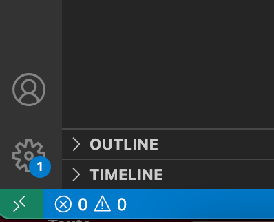

# Introduction to Vyper
The Ethereum Blockchain has a variety of smart contract languages you can interact with. The most popular is [Solidty](https://docs.soliditylang.org/en/v0.8.18/), and it has similar syntax to JavaScript. However, there is a new language on the rise called [Vyper](https://docs.vyperlang.org/en/stable/). This language has syntax like Python. It is easy to use and test with the python testing library called: pytest. This repository has some examples using Vyper to interact with a mocked Ethereum Blockchain.

## Env Setup
1. Download ```Remote - SSH``` from vscode extensions. 

   

   Once completed a green '><' symbol will appear on the bottom left of your screen as shown above. Click on that button and go to: Connect To Host -> Add New SSH Host. Then add your cs login to the cmd:
   ```
   ssh cs_login@best-linux.cs.wisc.edu
   ```
   You will then be prompted to login using duo factor authentication. You will use this linux env to run the Vyper code as it removes dependencies for windows vs mac users.
2. Once you are in the remote session you can create a new workspace. Create a new folder in the linux env that is easy for you to access.

## Installation
Once you have a workspace in the cs department remote library, you will need to download pytest and vyper in these locations. Open up a new terminal and execute the cmd:
```
pip install vyper pytest
```
Next you will need the pytest-vyper github:
```
pip install git+https://github.com/kaimast/pytest-vyper
```

## Contract Testing
There is a simple smart contract called example1 in this repository. The smart contract code is found in set_get_example.vy, while the unit tests are in the test_set_get.py file.

```Vyper``` file: Has a constructor called init, which sets the orignal contract_data values. It also has a set function to change these values and a get function to see what the current value is.

```pytest``` file: The constructor for the .vy is called in the ```set_get_contract``` method. It goes onto test the set function and ensuring an error is thrown when expected.

The big advantage of testing your smart contract is that you don't need to deploy it every single time to check behavior. Since smart contracts are immutable you would need to deploy a new contract each time you make a change. However with pytest you can create your own tests and check the results lcoally. Later we will show how to deploy one of these contracts to a testnet, rather than having pytest mock its own blockchain.


To execute the tests you can cd into example1 and run the cmd:
```
python3 -m pytest --disable-warnings -s
```
I highly encourage you to play around the code and create your own methods to test!